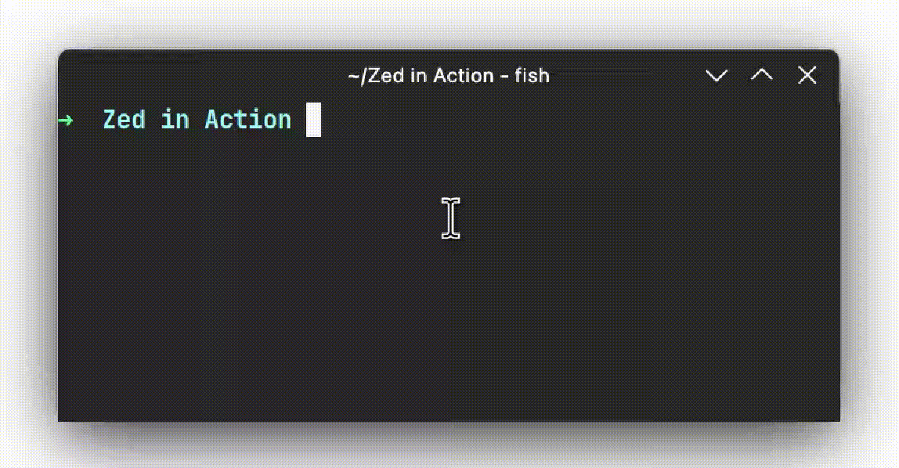

# zed

"zed" is a command line tool written in `Nim👑` that uses fzf (_Fuzzy Finder_) to allow the deletion of folders and files in a simple and efficient way.

With "zed", you can browse through your files and directories using an interactive interface and select multiple items for deletion by simply pressing the __TAB__ key. This functionality makes deleting files and folders faster and more convenient than traditional methods.



## Installation

```sh
wget https://raw.githubusercontent.com/gabrielcapilla/zed/main/setup && sh setup
```

## Build

## 1) Install Nim

[Nim](https://nim-lang.org/) is a statically typed compiled systems programming language. It combines successful concepts from mature languages like Python, Ada and Modula.

### 2) Clone the repository

```sh
git clone https://github.com/gabrielcapilla/zed.git
```

### 3) Change dir to `zed`

```sh
cd zed
```

### 4) Build program with `nimble`

```sh
nimble build
```

Use `-d:release` to generate faster code

```sh
nimble -d:release build
```

After that you will get a ready-made binary file in the root directory of the project.
